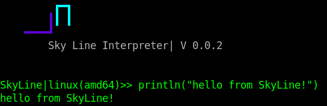

<p align="center">
  
</p>

# What is SkyLine 

SkyLine or CSC ( Cyber Security Core ) is a new interpreted programming language dedicated to just cyber security and mathematics. SkyLine plans to change the way the cyber security world operates by provided a much more slick and modern interface for security researches or cyber security solutions developers.

# Why just cybersecurity 

Cyber Security is a major part of the developers career, after all the whole reason SkyLine exists is due to CyberSecurity interests. However it was felt amongst the developers of the language that there was not a language out there that was really modern and well rounded for anything cyber security. There was just general purpose scripting languages liek Python or Perl which had libraries dedicated to cyber security which do not always work in the cases that they are developed. SkyLine wants to change that by standardizing both offensive and defensive cyber security.

# Operating system support 

Currenty SkyLine has a very small and limited interpreter however despite it not being OS dependant the current error system and banner system is a little wack if you are on windows. SkyLine has only been tested on windows as its main development purpose was for linux.

# Documentation 

SkyLine has many ways of allowing the user to full customization of the style within the language, due to this abstract design SkyLine has some pretty interesting ways of writing code. Below are examples and basic documentation on the SkyLine programming language.

# Upcoming in Skyline 

* A better Linker 
* Better error system 
* More color / ANSI / ASCII support
* Unicode support 
* Better literal support 
* Better Boolean support 
* Better standard statements 
* Better macro system 
* Better code system
* Server 
* Documentation
* Local documentation
* cyber security related base
* Format identifiers
* Format statements

> Output 

two simple ways to output data in SkyLine are ... 

```rs
println("hello world")
print("hello world")
```

there are other ways as well, for example say you declare a variable you can simple just place the variable name and skyline will output it 

```rs
let x = 10;

x
```

> Declaring variables 

* About: SkyLine has many ways of defining variables, types include float, string, bool and integer as of 0.0.2. Def keywords consist of `allow, let, cause`

here is a few ways you can declare variables in SkyLine 

```rs
allow Variable = "data"
let   Variable = "data"
cause Variable = "data"
```

cause, let and allow all do the same thing they are just different keywords

> Notes 

* Notes in SkyLine are not fully supported, as whitespace within the comment line is not fully yet finished. You can define a note like so 

```rs
!!anote
#anote
//anote
```

if you create a note that has spaces, like so 

```rs
!! hello there, ext, function name, name, variable
```

SkyLine will tell you there is an error in your statement such as `no parse prefix for !! found`. This is because comments are not fully supported

> Writing functions 

* Note: Functions in skyline can be developed and written in all sorts of ways but there are three main keywords which are `fn, Func and function`

Defining a function is like so

```rs
allow methodName = function() {

};

#or 

allow methodName = Func() {

};
```

functions are pretty simple, it is important to note that while semicolons are optional it is suggested to use them.

* FUNCTION RETURN AND OUTPUT 

* Note: When calling a function in SkyLine you can do multiple things, you can use the `ret` or `return` keywords to return a value or you can just call the function and have it output the variable by simply placing the variable in the function like so.

```rs
allow foo = function(x) {
    x - x;
}

let result = foo(10);

print(result);
```

result will hold the output to foo even tho return or ret keywords are not used, as with most keywords in this language **MOST** SkyLine allows you to op out of most tokens.

the following use ret and return statements 

```rs
allow foo = function(x) {
    ret x - x;
}

let result = foo(10);

print(result);
```

return 

```rs
allow foo = function(x) {
    ret x - x;
}

let result = foo(10);

print(result);
```

> Function arguments 

function arguments are pretty simple as well, with skyline there is no need to put the data type within the function before entering the variable. 

* Simple function arguments 

```rs
allow x = function(x) {
  x - x;
}
```

* Multiple function arguments 

```rs
allow x = function(x, y, z, w) {
      x - y - z * w;
}
```

or 

```rs
allow x = function(x : y : z : w) {
  x - y - z * w;
}
 
```

* Advanced function arguments 

```rs
let subroutine = function(a, b) { 
      a - b 
};

let applyFunction = Func(a, b, func) { 
     func(a, b) 
};

applyFunction(10, 2, sub);
```


> Data types, arithmatic expressions and boolean operations

Like every other language SkyLine carries supports for multiple forms of operations, conditionals and booleans. 

> Operators

| Operator | Working |
| -------- | ------- |
|    +     | yes     |
|    -     | yes     |
|    /     | yes     |
|    *     | yes     |
|    >     | yes     |
|    <     | yes     |
|    ==    | yes     |
|    !=    | yes     |
|    >=    | no      |
|    <=    | no      | 

using these operators works really any other way with any other programming languages, for ones that work you can use them for ones that do not work you can not use them.

```rs
#simple_operator_demo

allow subtract = 1 - 1;
allow multiply = 1 * 1;
allow divide   = 1 / 1;
allow add      = 1 + 1;

println(add, divide, multiply, subtract);
```

You can use boolean operators like so 

```rs
allow isoneequalone = 1 == 1;
allow doesnoteqone  = 2 != 1;
```

quite simple 

Conditionals are also a bit weird in skyline, as like some parameters you can opt out using (). For example we can write conditionals like so

```rs
if (1 == 1) {
  print("eq")
} else {
  print("not eq")
}
```

or we can write conditionals like this 

```rs
if 1 == 1 {
  print("eq")
} else {
  print("not eq")
}
```

as far as conditional statements go that is all there is. 

Data types in SkyLine only consist of STRING, BOOL, FUNC, NIL, ERROR, INT and FLOAT which can be written like so 

```rs

let integerval = 1;
let floatval = 1.4;
let boolval = true; 
let boolval = false;
let strval = "string";
let funcval = Func() {};
let nilval = "";
```

nill is not a full fledged data type however in some cases you will see `nil` or `null` pop up within a function call, output statement or whatever it may be that returns NULL.

> Hash maps and arrays 

arrays and hash maps are actually really interesting, arrays and hashes have their own unique data types called HASH and ARR (Array) which can hold any data type within a mash. 

* Simple integer array 

```rs
allow myarray = [1, 2, 3, 4, 5, 6]
```

* Simple multi type array 

```rs
allow myarray = ["data", 1, true, false, 1.0]
```

* Mashed type array

```rs
allow MyArray_MIXED = [ 
  "data",
  1.15,
  true,
  false,
  Func(data) { print(data) },
  function(x, y) { x - y }]
```

* Simple hash map

```rs
allow hashmap = {
  "key": "value",
};
```

* Mixed type hash map 

```rs
allow hashmap = {
  "key": "value",
  
  1: "value2",
  
  1.9: 1,
  
  2: 1.8,
  
  true: false,
  
}
```

* Annoyingly stupid hash map but very possible hash map 

```rs
allow hashmap = {
    "key": "value",
  
  1: "value2",
  
  1.9: 1,
  
  2: 1.8,
  
  true: false,
  
  "function" : function(x, y) { x - y},
  
  "arr": [1, 2, 3, 4, 5],
  
  "hash map within a hash map": { "key" : value },
  
  "hash map inception": { "hashmap" : {"hashmap": {"value": function(x, y) { x - y} }}},
}
```

> Standard functions 

in skyline there are going to be alot of standard functions within the language, below is a list of standard functions / keywords and what they do

| keyword / function | description or operation |
| ------------------ | ------------------------ |
| sprint             | will turn any data type into a string |
| print              | print a value or variable |
| println            | print a value or variable with a new line |
| OS_                | Grabs operating system data |
| USER_              | Grabs user data |
| HASHIT             | Hashes a string in either MD5, SHA1, SHA512, SHA256, SHA225 or SHA384 |
| SkyLine__          | Searches about a standard function |
| length             | get the length of a variable |
| last               | get the last variable in an array |
| first              | get the first variable in an array |
| push               | push a variable into an array |
| rest               | outputs everything but the first variable or value in an array |
| input              | grabs user input |

* Using input 

using input is simple ( for right now ). You call input like any normal input function, however instead of just assigning it to a variable you can tell the input how to register a input value. This is basically a way of telling SkyLine you want to capture input after tab, new line etc etc. Currently newline or n is the only one supported, needing less to say here is how you capture user input 

```rs
allow userinput = input("Console>>", n);

println(userinput)
```

this will get the user input with the message "Console>>" and will capture the output without Console>> within the response.

* Using Length 

using length is as simple as it sounds, it gets the length of a variable, list, array etc. Length only supports two data types `String and Array`

```rs

#length_on_array

allow arr = [1, 2, 3]

println(length(arr))

#length_on_char

allow char = "data"

println(length(char));
```

* Using rest, push, first, last 

this is also pretty simple, push pushes a value to an array, first gets the first value of the array and last gets the last value in the array 

```rs
allow arr = [1, 2, 3, 4, 5, 6, 7]

println(rest(arr))
println(first(arr))
println(last(arr))

push(arr, 8)
```

* OS_

OS_ is a standard function within SkyLine which allows you to get the OS name and architecture like so 

```rs

println(OS_("os_name")) #linux
println(OS_("os_arch")) #x64
```

* USER_

user is simple like OS_ but for users. This function can get the home directory, the GID, the UID, the name and the username of the person running the program

```rs
println(USER_("username"))
println(USER_("user"))
println(USER_("gid"))
println(USER_("uid"))
println(USER_("hdir"))
```

* SkyLine__

SkyLine__ this function is a lookup function for any standard function within the language that may have been added to this search, it will output what the function does and then output its methods and arguments if it has or requires any 

```
SkyLine__("USER")
SkyLine__("OS")
```


